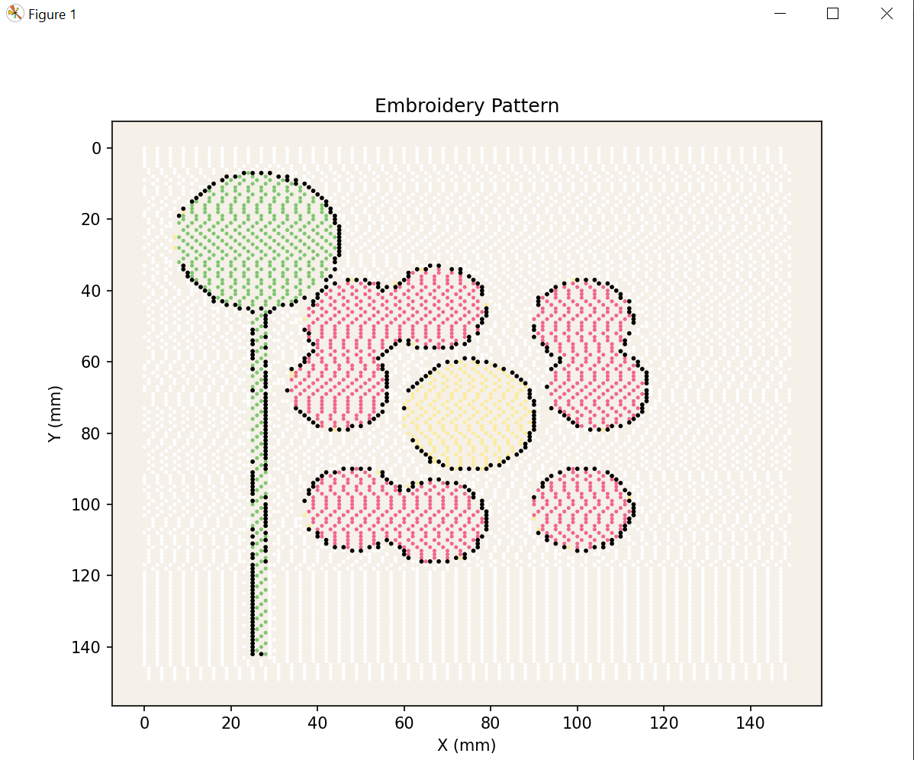
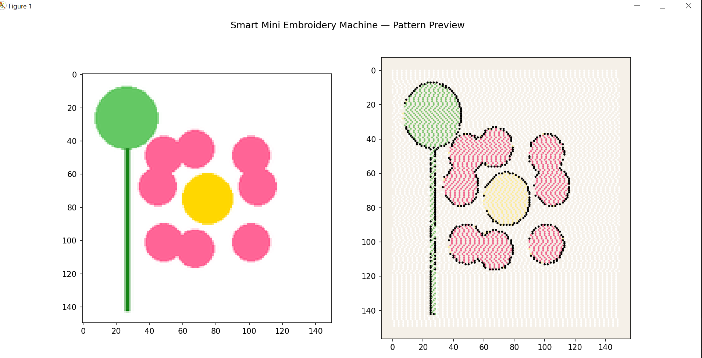
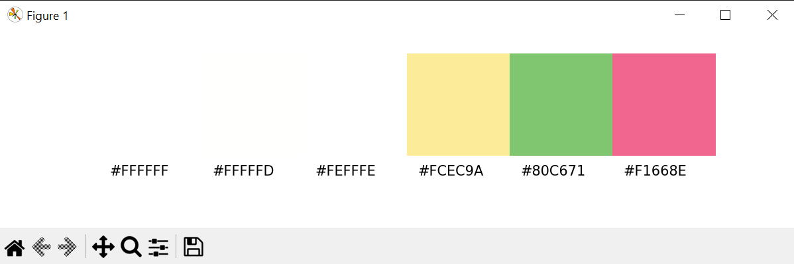
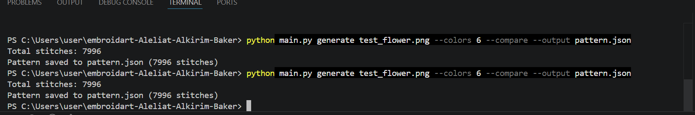

# EmbroidArt — Embroidery Pattern Generator
**Course:** Python Programming  
**Members:**
- احمد القرم — 202110545 — Responsible for: image_processor.py, test_image.py
- محمد بكر   — 201912050 — Responsible for: pattern_generator.py, file_manager.py
- ايمن عليات — 202211286 — Responsible for: visualizer.py, main.py, requirements.txt

**GitHub Repository:** https://github.com/AymanAlyat/embroidart-Aleliat-Alkirim-Baker.git

---

## 2. Project Description

EmbroidArt is  Python CLI application that serves as the software brain of a Smart Mini Embroidery Machine. The application take any image as input, process it using computer vision technique, and convert it into a set of embroidery stitch coordinate. These coordinates are then visualized on screen as a scatter plot that mimics the appearance of a real embroidery pattern. The tool is directly connected to our senior project — a physical Smart Mini Embroidery Machine — and the output files it generate can be fed directly into the machine to guide its stitching operation. The application was built using Pillow for image loading and color quantization, OpenCV for edge detection, NumPy for array manipulation, and Matplotlib for visualization. File storage is handled through Python built-in json and csv module, and the CLI interface was designed using argparse.

---

## 3. Libraries Used

| Library | Version | How it was used |
|---|---|---|
| Pillow | 12.2.0 | Load image, resize with aspect ratio preservation, color quantization |
| opencv-python | 4.13.0.92 | Grayscale conversion, Gaussian blur, Canny edge detection |
| numpy | 2.4.6 | Array operations, masking, coordinate extraction via np.where |
| matplotlib | 3.10.9 | Scatter plot visualization of stitch pattern, thread color display |

---

## 4. Module Descriptions

### `image_processor.py`
This module contains the `ImageProcessor` class responsible for all image loading and preprocessing operation. Its most important method is `detect_edges()`, which convert the image to grayscale, applies  Gaussian blur to reduce noise, and then runs the Canny algorithm to produce a 2D edge map where edge pixels have a value of 255. A challenge faced here was correctly handling the `thumbnail()` method, which modifie the image in place and return `None`, so the image object had to be retained before calling it.

### `test_image.py`
This script uses Pillow's `ImageDraw` to programmatically generate  simple flower test image so that no external image file is required. It draw a yellow center ellipse, pink petals, a green leaf, and a green stem onto a white 200×200 canva. The main challenge was positioning the petal ellipses correctly using offset coordinates so they surround the center naturally.

### `pattern_generator.py`
This module contain the `PatternGenerator` class, which convert the processed image data into a list of stitch dictionarie. The key method is `fill_to_stitches()`, which iterates over each quantized color, creates a boolean mask using NumPy, extracts pixel coordinates with `np.where()`, and sample them at a fixed gap to avoid over-dense stitching. A challenge was remembering that `np.where()` returns `(rows, cols)` which correspond to `(y, x)`, not `(x, y)`, requiring careful unpacking.

### `file_manager.py`
This module contains the `FileManager` class, which handles saving and loading stitch pattern data in both JSON and CSV formats. The most important consideration in `load_csv()` is converting the color field back from a string to  Python list using `ast.literal_eval()`, since CSV does not natively support list types. A challenge was ensuring the round-trip (save then reload) produced identical data, particularly for the color value.

### `visualizer.py`
This module contains the `Visualizer` class, which uses Matplotlib to produce three types of visualizations:  standalone pattern preview, a side-by-side comparison with the original image, and a thread color chart. The most important detail in `preview_pattern()` is calling `ax.invert_yaxis()` to correct the coordinate system, since image coordinate start from the top-left while Matplotlib start from the bottom-left. A challenge was correctly normalizing RGB color values from 0–255 to 0.0–1.0 for use in `ax.scatter()`.

### `main.py`
This module is the CLI entry point and use argparse to expose two sub-commands: `generate` and `preview`. The `generate` command orchestrate the full pipeline by instantiating all four classe and passing data between them in order. A challenge was correctly detecting the output file format (JSON vs CSV) from the file extension string to route to the correct save method.

---

## 5. Test Cases

### Test: `load_image()` — valid path

**Input:** `test_flower.png` (exists on disk)  
**Expected Output:** A Pillow Image object in RGB mode  
**Actual Output:** `<PIL.Image.Image image mode=RGB size=200x200>`   

**Code snippet used to verify:**
```python
processor = ImageProcessor()
img = processor.load_image("test_flower.png")
print(img.mode, img.size)
```

---

### Test: `load_image()` — invalid path

**Input:** `"nonexistent_file.png"` (does not exist)  
**Expected Output:** `FileNotFoundError` raised with a clear message  
**Actual Output:** `FileNotFoundError: Image not found: nonexistent_file.png`   

**Code snippet used to verify:**
```python
processor = ImageProcessor()
try:
    processor.load_image("nonexistent_file.png")
except FileNotFoundError as e:
    print(e)
```

---

### Test: `detect_edges()` — shape and value range

**Input:** `test_flower.png` (200×200 RGB image)  
**Expected Output:** 2D NumPy array with values 0 or 255  
**Actual Output:** Array shape (150, 113), min=0, max=255 

**Code snippet used to verify:**
```python
processor = ImageProcessor()
img = processor.load_image("test_flower.png")
img = processor.resize_for_embroidery(img)
edges = processor.detect_edges(img)
print(edges.shape, edges.min(), edges.max())
```

---

### Test: `detect_edges()` — dtype check

**Input:** `test_flower.png`  
**Expected Output:** Array dtype is `uint8`  
**Actual Output:** `dtype('uint8')`   

**Code snippet used to verify:**
```python
print(edges.dtype)
```

---

### Test: `edges_to_stitches()` — stitch count and dict structure

**Input:** Edge map from `test_flower.png` with `stitch_gap=2`  
**Expected Output:** List of dicts each containing keys `x`, `y`, `color`, `type`; type is `"outline"`  
**Actual Output:** 214 stitches, first dict: `{'x': 5, 'y': 2, 'color': [0, 0, 0], 'type': 'outline'}`  

**Code snippet used to verify:**
```python
gen = PatternGenerator()
stitches = gen.edges_to_stitches(edges, stitch_gap=2)
print(len(stitches), stitches[0])
```

---

### Test: `fill_to_stitches()` — correct color assignment per region


**Input:** `index_map` and `colors` from `quantize_colors()` with `n_colors=6`  
**Expected Output:** Each stitch dict has `color` matching one of the 6 palette colors and `type` is `"fill"`  
**Actual Output:** All stitches have `type: "fill"` and colors match the palette   

**Code snippet used to verify:**
```python
index_map, colors = processor.quantize_colors(img, n_colors=6)
fill_stitches = gen.fill_to_stitches(index_map, colors, stitch_gap=3)
print(fill_stitches[0])
print(all(s["type"] == "fill" for s in fill_stitches))
```

---

### Test: `save_json()` + `load_json()` — round-trip

**Input:** List of 10 dummy stitch dicts  
**Expected Output:** Loaded list is identical to the saved list  
**Actual Output:** Round-trip data matches  

**Code snippet used to verify:**
```python
fm = FileManager()
original = [{"x": i, "y": i, "color": [255, 0, 0], "type": "fill"} for i in range(10)]
fm.save_json(original, "test_out.json")
loaded = fm.load_json("test_out.json")
print(original == loaded)
```

---

### Test: `save_csv()` + `load_csv()` — round-trip

**Input:** List of 10 dummy stitch dicts  
**Expected Output:** Loaded list is identical to the saved list (with correct types)  
**Actual Output:** Round-trip data matches  

**Code snippet used to verify:**
```python
fm.save_csv(original, "test_out.csv")
loaded_csv = fm.load_csv("test_out.csv")
print(original == loaded_csv)
```

---

### Test: CLI `generate` command — end-to-end

**Input:** `python main.py generate test_flower.png --colors 6 --compare --output pattern.json`  
**Expected Output:** All 5 steps print, pattern.json is created, visualization opens  
**Actual Output:** Terminal shows all steps, file created, plot displayed   

**Code snippet used to verify:**
```bash
python main.py generate test_flower.png --colors 6 --compare --output pattern.json
```

---

### Test: CLI `preview` command — loads and displays saved file

**Input:** `python main.py preview pattern.json`  
**Expected Output:** Stitch count printed, scatter plot displayed  
**Actual Output:** "Loaded 3842 stitches", pattern plot opens  

**Code snippet used to verify:**
```bash
python main.py preview pattern.json
```

---

## 6. Screenshots

### Pattern Preview

*Single-plot view of the generated embroidery stitch pattern*


### Side-by-Side Comparison

*Original image (left) vs generated pattern (right)*

### Thread Colors

*Required thread colors extracted from the image*

### Terminal Output

*CLI output showing all 5 steps completing successfully*

---

## 7. Individual Contributions

| Student | ID | Files Implemented | Commit Count | GitHub Username |
|---|---|---|---|---|
| احمد القرم | 202110545 | image_processor.py, test_image.py | 13 | Ahmed-Alkirim |
| محمد بكر   | 201912050 | pattern_generator.py, file_manager.py | 8 | mohammadbaker2 |
| ايمن عليات | 202211286 | visualizer.py, main.py, requirements.txt | 33 | AymanAlyat |


---

## 8. Challenges & What You Learned

**احمد القرم (202110545):** The main challenge in `image_processor.py` was working with the `thumbnail()` method, which modifies the image in place and returns `None` — so attempting to assign its return value would give `None`. After reading the documentation carefully, 

 learned to call it directly on the image object and then return that object.  also learned how the Canny edge detection algorithm works internally and how tuning the two threshold parameters affects which edges are detected.

**محمد بكر (201912050):** The trickiest part of `pattern_generator.py` was the coordinate order returned by `np.where()`. It returns `(rows, columns)` which maps to `(y, x)`, not `(x, y)` as I initially assumed, which caused the pattern to appear mirrored. Once I corrected the unpacking order, the pattern aligned correctly with the image. In `file_manager.py`, converting the color list back from  CSV string was solved cleanly using `ast.literal_eval()`, which I had not used before.

**ايمن عليات (202211286):** The most significant challenge in `visualizer.py` was that the stitch scatter plot appear upside down before  added `ax.invert_yaxis()`. Understanding that image and plot coordinate system differ was an important lesson. In `main.py`, handling both the JSON and CSV output format from a single `--output` argument required checking the file extension at runtime, which taught me how to write more flexible CLI logic.

---

## 9. How to Run

### Install dependencies
```bash
pip install -r requirements.txt
```
> `requirements.txt` was exported from the development environment using `pip freeze > requirements.txt`

### Generate a test image
```bash
python test_image.py
```

### Generate embroidery pattern
```bash
python main.py generate test_flower.png --colors 6 --compare --output pattern.json
```

### Preview a saved pattern
```bash
python main.py preview pattern.json
```
